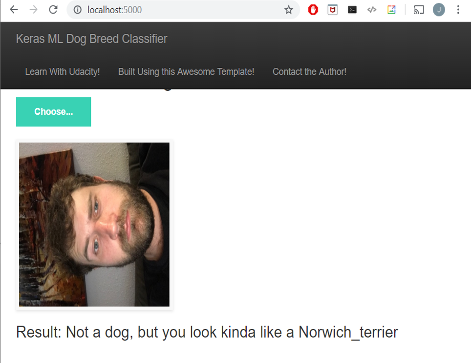

# Dog Breed Classifier Flask App

> What kind of dog do you most resemble to a machine? Using Keras and VGG19, upload a file and find out!

------------------

## Acknowledgements
Most of the html, css and javscript for this app is taken verbatim from this amazing [github repo](https://github.com/mtobeiyf/keras-flask-deploy-webapp.git), all rights to [mtobeiyf](https://github.com/mtobeiyf), distributed under GNU general public license.

## How to run the app
- Clone this repo
- Install requirements
- Run python run.py in the root directory
- Check http://localhost:5000
- Load an image and have fun!

:point_down:Screenshot:

  

